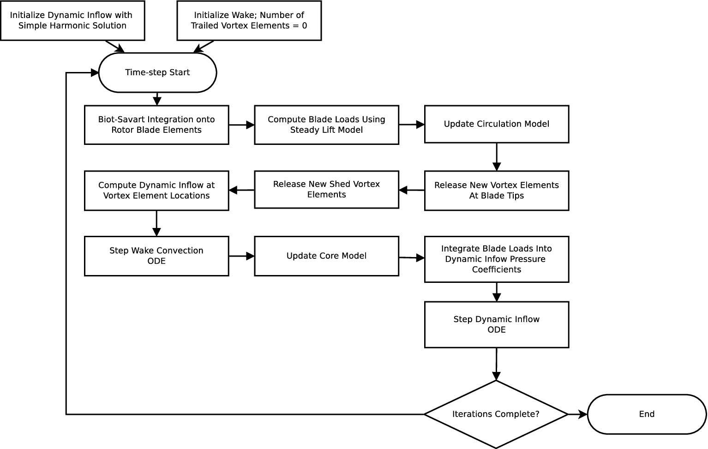
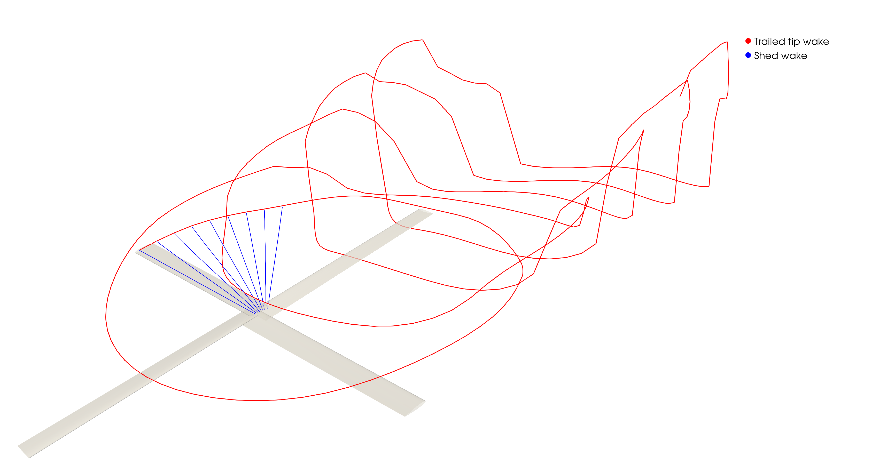

High Level Overview
===================

At a high level, this method uses a dynamic inflow model that is capable of quickly computing the induced velocity of a rotor, to advect vortex elements downstream. These released vortex elements are then used to compute the inflow at the rotor. This allows us to quickly compute a dynamically reacting wake without the cost of computing the influence of each vortex element with all other vortex elements. The dynamic inflow model is based on potential flow theory, which allows the use of linear superposition to create a combined multirotor flow field.

Solution Procedure
===================
The present model is inspired by Van der Wall's :cite:p:`van_der_wall_extensions_2012` generalization of Beddoes' inflow prescribed wake model :cite:p:`beddoes_wake_1985`. A high-level flow chart outlining the solution procedure is shown in figure :numref:`opencopter_flow`. The convection of the wake is loosely coupled to a  nonuniformly loaded actuator disk dynamic inflow model. The coupled models are stepped until a quasi-steady state is achieved. The simulation is initialized with no trailed wake and uses a simple harmonic solution to equations :eq:`main_system` and :eq:`adjoint_system` to initialize the dynamic inflow model states. At the start of each timestep the inflow on the blades is computed from the Biot-Savart integration of the wake (this is initially zero) and blade loads are computed. With the blade loads known the circulation model can then be updated. The wake model then releases new vortex elements at the blade tips. The dynamic inflow model will then be used to compute the induced velocity at each vortex element. The blade loads are then integrated into the pressure coefficients needed by the dynamic inflow model. Finally equations :eq:`main_system`, :eq:`adjoint_system`, and :eq:`wake_convect` are updated to the next timestep.

.. _opencopter_flow:

	High level flow chart of the model

Dynamic Inflow Model
--------------------
The dynamic inflow model used for this work is an implementation of the model developed in the following references Huang et al. :cite:p:`huang_converged_2015` with extensions provided by Gunar et al. :cite:p:`guner_approximate_2021`. It provides the inflow caused by an actuator disk anywhere in space through a blending of several different inflow solutions depending on where they are best suited. As part of the Peters dynamic inflow model lineage, this model solves the incompressible potential flow equations along the free-steam line. By the nature of the potential flow equations being a form of Laplace's equation, the system can be solved in ellipsoidal coordinates for the pressure discontinuity on the disk using a separation of variables solution with the pressure potential being one of either:

.. math::
      \Phi^m_n &= \frac{1}{\nu}P^m_n(\nu)Q^m_n(i\eta)\cos(m\psi)

      \Phi^m_n &= P^m_n(\nu)Q^m_n(i\eta)\cos(m\psi)

The first form is used with Nowak-He (NH) state variables and the second with Morillo-Duffy (MD) state variables. The NH form converges well on the disk while the MD form converges well everywhere else.

The derivation of the model will largely be skipped here for brevity, but an overview of the implementation details follows. There are two base velocity formulations and their adjoints that the rest of the solution builds upon, based on the two different potential forms:

.. math::
	:nowrap:

	\begin{align}
		V_{MD} &= \sum_{m,n}^\infty a^m_n P^m_n(\nu)Q^m_n(i\eta)\cos(m\psi) \\
		V_{NH} &= \sum_{m+n=odd}^\infty \alpha^m_n \frac{1}{\nu}P^m_n(\nu)Q^m_n(i\eta)\cos(m\psi) \nonumber \\
		&+ \sum_{m+n=even}^\infty a^m_n P^m_n(\nu)Q^m_n(i\eta)\cos(m\psi)  \\
		V_{MD}^* &= \sum_{m,n}^\infty \Delta^m_n P^m_n(\nu)Q^m_n(i\eta)\cos(m\psi) \\
		V_{NH}^* &= \sum_{m+n=odd}^\infty \Lambda^m_n \frac{1}{\nu}P^m_n(\nu)Q^m_n(i\eta)\cos(m\psi) \nonumber \\
		&+ \sum_{m+n=even}^\infty \Delta^m_n P^m_n(\nu)Q^m_n(i\eta)\cos(m\psi)
	\end{align}

where :math:`a^m_n` are the MD state variables and :math:`\alpha^m_n` are the NH state variables and :math:`\Delta^m_n` and :math:`\Lambda^m_n` are their respective adjoint states. These state variables are transformations of one-another through the following relation:

.. math::
	:nowrap:

	\begin{align}
		&\{a^m_j\} = [A^m_{nj}]^{-1}\{\alpha^m_n\} \\
		&\{\Delta^m_j\} = [A^m_{nj}]^{-1}\{\Lambda^m_n\} \\
		&[A^m_{nj}] = \frac{(-1)^\frac{n + j - 2m}{2}2\sqrt{2n + 1}\sqrt{2j + 1}}{\sqrt{H^m_n}\sqrt{H^m_j}(n + j)(n + j + 2)\left[(n + j)^2 - 1 \right]} \\
		&H^m_n = \frac{(n + m - 1)!!(n - m - 1)!!}{(n + m)!!(n - m)!!}
	\end{align}

The state variables are computed through the following system:

.. math::
	:label: main_system

	\boldsymbol{M}_{NH}\{\dot\alpha^m_n\} + \boldsymbol{D}\boldsymbol{V}\boldsymbol{L}^{-1}\boldsymbol{M}_{NH}\{\alpha^m_n\} = \boldsymbol{D}\{\tau^m_n\}
	
.. math::
	:label: adjoint_system

	-\boldsymbol{M}_{NH}\{\dot\Lambda^m_n\} + \boldsymbol{D}\boldsymbol{V}\boldsymbol{L}^{-1}\boldsymbol{M}_{NH}\{\Lambda^m_n\} = \boldsymbol{D}
	\begin{bmatrix}\ddots & & \\ & (-1)^{j + 1} & \\ & & \ddots\end{bmatrix}\{\tau^m_n\}

Where :math:`\boldsymbol{V}` is the diagonal mass flow matrix:

.. math::
   \boldsymbol{V} = \begin{bmatrix} 
   V_T & & & \\
   & V & &\\
   && V & \\
   &&& \ddots
   \end{bmatrix}

Where :math:`V_T` is the total average flow at the rotor and :math:`V` is the mass-flow parameter:

.. math::
	&V_T = \sqrt{V^2_\infty\sin^2{\chi} + (V_\infty\cos{\chi} + \bar v_z)^2}

	&V = \frac{V^2_\infty\sin^2{\chi} + (V_\infty\cos{\chi} + \bar v_z)(V_\infty\cos{\chi} + 2\bar v_z)}{V_T}

:math:`\bar v_z` is the average induced velocity at the rotor:

.. math::
	\bar v_z = \sqrt{3}\begin{bmatrix}
		1 & 0 & \hdots
	\end{bmatrix}\boldsymbol{L}^{-1}\boldsymbol{M}_{NH}\{\alpha\}

The equations for the rest of the matrices can be found in reference :cite:p:`morillo_velocity_2002`.
        
With the system in place to time-march the required states, the final induced velocity computation can take place. The final induced velocity contains several different blends to ensure an accurate solution can be found both above and below the rotor as well as upstream and down stream. The first blended solution, called :math:`V_{BL}`, blends together the NH solution on the disk, and the MD off the disk, i.e.,

.. math::
    V_{BL} = \frac{1}{1 + bh}V_{NH} + \frac{bh}{1 + bh}V_{MD}

    V_{BL}^* = \frac{1}{1 + bh}V_{NH}^* + \frac{bh}{1 + bh}V_{MD}^*

where

.. math::
	h = \begin{cases}
		0 & \text{if } \eta < \varepsilon \\
		\eta - \varepsilon & \text{if } \eta \geq \varepsilon
	\end{cases}

and

.. math::

	b = \begin{cases}
		20\left[1 - \frac{y^2\sin{\chi}}{1 + \eta^2}\right] & x \leq 0, |y| \leq 1 \\
		& \\
		20\left[1 - \frac{y^2\sin{\chi}}{1 + \eta^2 + 0.615(y^2 - 1)}\right] & x \leq 0, |y| > 1 \\
		& \\
		20\left[1 - \frac{(x^2 + y^2)\sin{\chi}}{1 + \eta^2}\right] & x > 0, |y| \leq 1 \\
		&\\
		20\left[1 - \frac{(x^2 + y^2)\sin{\chi}}{1 + \eta^2 + 0.615(y^2 - 1)}\right] & x > 0, |y| > 1
	\end{cases}

A value of :math:`\varepsilon = 0.01` was used in this work.

Next, the downstream solution is constructed to account for the fact that the trailed rotor wake does not immediately decay to zero in edgewise flight. Leveraging the adjoint theorem and the blended solution the downstream velocity and its adjoint are given by

.. math::
	:label: downstream_vel

	V_{DS}(x, y, z, y) &= V_{BL}(-s_0, y, z, t - \sigma\sin{\chi}) \\
	& + V_{BL}^*(+s_0, -y, z, t - \sigma\sin{\chi})  \\
	& - V_{BL}^*(\sigma+s_0, -y, z, t)

.. math::
	:label: downstream_vel_adjoint

	V_{DS}^*(x, y, z, y) &= V_{BL}^*(-s_0, y, z, t + \sigma\sin{\chi}) \\
	& + V_{BL}(+s_0, -y, z, t + \sigma\sin{\chi}) \\
	& - V_{BL}(\sigma+s_0, -y, z, t)

where :math:`s_0` is the x-distance downstream where the blended solution is converged:

.. math::

	s_0 = \begin{cases}
		\sqrt{1 - y^2 - z^2} & \text{if } y^2 + z^2 < 1 \\
		0 & \text{if } y^2 + z^2 \geq 1
	\end{cases}

and :math:`\sigma` is the distance downstream to the desired point from :math:`s_0`, such that :math:`\sigma = -x - s_0`. The final velocity and its adjoint are then given by

.. math::
	:label: final_vel

	V_F = V_{BL}[1 - f(s_0, \chi, y)] + V_{DS}[f(s_0, \chi, y)]
	
	V_F^* = V_{BL}^*[1 - f(s_0, \chi, y)] + V_{DS}^*[f(s_0, \chi, y)]

where

.. math::

	f(\sigma, \chi, y) = \begin{cases}
		\frac{\sin^2{\chi}}{\sin^2{\chi} + \sigma g(\chi)} & \text{if } |y| \leq 1 \\
		\frac{\sin^2{\chi}}{\sin^2{\chi} + (\sigma + 1.5\sqrt{y^2 - 1})g(\chi)} & \text{if } |y| > 1 
	\end{cases}

and

.. math::

	g(\chi) = 1.84\cos^{1/2}{\chi} - 4.06\cos{\chi} + 11.84\cos^{3/2}{\chi}

For the flow above the rotor disk, equation :eq:`final_vel` is all that is needed. Below the disk one last application of the adjoint theorem is required:

.. math::
	:nowrap:
	:label: final_dyn_vel
	
	\begin{align}
		V(x, y, z, t) &= V(z, r, \psi, t) \nonumber \\
		& = V_F(t - s, 0, r, \psi) \nonumber \\
		& + V_F^*(t - s, 0, r, \psi + \pi) \nonumber \\
		& - V_F^*(t, -z, r, \psi + \pi)
	\end{align}
	
where :math:`s` is the distance from the desired point to the point on the rotor along the free-stream line.

As seen in equations :eq:`downstream_vel`, :eq:`downstream_vel_adjoint`, and :eq:`final_dyn_vel`, data from previous times is required to compute the velocity both below and downstream of the rotor disk. Further, equation :eq:`adjoint_system` is unstable in forward integration due to the nagative sign. To address these issues an extension developed by Guner et al. :cite:p:`guner_approximate_2021`. In this extension employs a quasi-steady approximation to compute the adjoint states at the current time, as well as a scheme to avoid reverse integration to compute past data. This is done by dropping the derivative terms of equations :eq:`main_system` and :eq:`adjoint_system`. Then solving equation :eq:`adjoint_system` for the adjoint states yields:

.. math::

	\{\Lambda^m_n\} = \boldsymbol{M}_{NH}^{-1}\boldsymbol{L}\boldsymbol{V}^{-1} 
	\begin{bmatrix}\ddots & & \\ & (-1)^{j + 1} & \\ & & \ddots\end{bmatrix}\{\tau^m_n\}

The solving the quasi-steady equation :eq:`main_system` for :math:`\{\tau^m_n\}` and plugging into the previous equation yields:

.. math::
	:label: adjoint_qs

	\{\Lambda^m_n\} = \boldsymbol{M}_{NH}^{-1}\boldsymbol{L}\boldsymbol{V}^{-1} 
	\begin{bmatrix}\ddots & & \\ & (-1)^{j + 1} & \\ & & \ddots\end{bmatrix}\boldsymbol{V}\boldsymbol{L}^{-1}\boldsymbol{M}_{NH}\{\tau^m_n\}
	

To avoid reverse integration past states are stored and an interpolation is performed to the desired time. Then by equation :eq:`adjoint_qs`, the past adjoint states are also computed.

There are also instances where data from a future time are required. These instances arise when computing the downstream velocity very close to the disk. This largely avoided due to the downstream blending function, but there is a small region where the blending function hasn't fully removed the downstream solution. For this another quasi-steady approximation is used. When data for a future time are required, they are instead approximated using the states from one full rotor revolution in the past.
        
        
Lift Model
----------

Blade loads are computed using blade element theory. The lift at each blade element is computed as

.. math::

	\mathrm{d}L = \frac{1}{2}\rho ||{\boldsymbol U}||^2 c C_l \mathrm{d}y

The local blade element flow velocity :math:`\boldsymbol U` is defined as

.. math::

	\boldsymbol U = u_t \hat x + u_p\hat z

The component :math:`u_t` is the local flow velocity tangent to the rotor tip-path plane (TPP) and normal to the blade element. The component :math:`u_p` is the flow velocity perpendicular to the TPP. The tangential velocity component is computed as

.. math::

	u_t = \Omega y + V_\infty\cos(\alpha_s)\cos(\psi)

The perpendicular velocity is computed through the Biot-Savart integration of both the shed and trailed wake. This is discussed in detail below. The non-circulatory unsteady portion of the lift is taken care of through the shed-wake vortex elements allowing the use of the steady lift equation here.

The inflow angle into the blade element is computed as

.. math::

	\phi = \tan^{-1}\left(\frac{u_p}{u_t}\right) 

which then allows the computation of the local angle of attack

.. math::

	\alpha = \theta - \phi

where :math:`\theta` is the local blade twist angle. This angle of attack is then fed into the circulation model to compute the blade bound vortex strength.

Circulation Model
-----------------
To compute the bound circulation on the blade the Weissinger-L model :cite:p:`weissinger_lift_1947` is used with extensions provided by Wickenheiser and Garcia :cite:p:`wickenheiser_aerodynamic_2007`. The Weissinger-L model treats a tapered and swept blade as a lifting line with a known angle of attack at each blade section. The extensions provided by Wickenheiser and Garcia allow for arbitrarily curved blade planforms. The blade is divided into :math:`N` colocation points with a cosine spacing such that:

.. math::

	\phi_\nu &= \frac{\nu\pi}{N + 1}

	r &= \cos(\phi_\nu)

where :math:`\nu = 0,...,N` and :math:` -1 < r < 1`. The local angle of attack at the blade is then related to the normalized circulation strength :math:`G` and blade geometry through the following integral:

.. math::
	:label: circ_int

	\alpha(\phi_\nu) = \frac{1}{2\pi}\int_0^\pi \frac{G'(\phi)}{\cos(\phi) - \cos(\phi_\nu)}\mathrm{d}\phi - \frac{1}{4\pi}\int_0^\pi P(\phi_\nu, \phi) G'(\phi)\mathrm{d}\phi + \frac{R}{4\pi c(\phi_\nu)}\int_0^\pi P(\phi_\nu, \phi) G'(\phi)\mathrm{d}\phi

Where :math:`G'` is the derivative of the circulation strength of the bound vortex. It has the form:

.. math::
	:label: circ_der

	G'(\phi) &= \sum_{n=1}^N G_n h_n(\phi)

	G(\phi) &= \sum_{n=1}^N G_n f_n(\phi)

where

.. math::

	h_n(\phi) &= \frac{2}{1 + N}\sum_{k=1}^N k\sin(k\phi_n)\cos(k\phi)

	f_n(\phi) &= \frac{2}{1 + N}\sum_{k=1}^N \sin(k\phi_n)\sin(k\phi)

The functions :math:`P` and :math:`R` are functions of the blade geometry

.. math::

	P(\phi_\nu, \phi) &= \frac{1}{\cos(\phi_\nu) - \cos(\phi)}\left[\frac{\xi(\phi_\nu) - \xi(\phi) + \frac{1}{2}}{\sqrt{\left[\xi(\phi_\nu) - \xi(\phi) + \frac{1}{2}\right]^2 + \left[R/c(\phi_\nu)\right]^2[\cos(\phi_\nu) - \cos(\phi)]^2}} - 1\right]

	R(\phi_\nu, \phi) &= \frac{\xi(\phi_\nu) - \xi(\phi) + \frac{1}{2} + \xi'(\phi)(\cos(\phi) - \cos(\phi_\nu))}{\left(\left[\xi(\phi_\nu) - \xi(\phi) + \frac{1}{2}\right]^2 + \left[R/c(\phi_\nu)\right]^2[\cos(\phi_\nu) - \cos(\phi)]^2\right)}

where :math:`\xi(\phi) = x(\phi)/\bar c` is the :math:`x`-coordinate position of the blade quarter chord line normalized by the average blade chord and :math:`\xi'(\phi)` is its first spatial derivative.

A system of equations can be assembled by plugging in equation :eq:`circ_der` into equation :eq:`circ_int` and applying trapezoidal integration to the second two integrals. The first integral can be solved analytically. This results in the following equation:

.. math::

	\begin{split}
		\alpha(\phi_\nu) =& \frac{1}{1 + N}\sum_{n=1}^N G_n \sum_{k=1}^N \frac{k\sin(k\phi_n)\sin(k\phi_\nu)}{\sin(\phi_\nu)} \\
		&- \frac{1}{4(M + 1)}\sum_{n=1}^N G_n \left[\frac{P(\phi_\nu, 0)h_n(0) - P(\phi_\nu, \pi)h_n(\pi)}{2} + \sum_{\mu=1}^{M}P(\phi_\nu, \phi_\mu)h_n(\phi_\mu)\right] \\
		&+ \frac{1}{4(M + 1)}\left(\frac{R}{c(\phi_\nu)}\right)^2\sum_{n=1}^N G_n \sum_{\mu=1}^M R(\phi_\nu, \phi_\mu) f_n(\phi_\mu)\sin(\phi_\mu)
	\end{split}

where :math:`M` is the number of integral points to compute and

.. math::

	\phi_\mu = \frac{\mu\pi}{M + 1}

This can now be assembled as a system of linearly independent equations in the form

.. math::
	\boldsymbol\alpha = \boldsymbol A \boldsymbol G

Where the coefficient matrix :math:`\boldsymbol A` is built as such:

.. math::

	\begin{split}
		\boldsymbol A =& \frac{1}{1 + N} \sum_{k=1}^N \frac{k\sin(k\phi_n)\sin(k\phi_\nu)}{\sin(\phi_\nu)} \\
		&- \frac{1}{4(M + 1)}\left[\frac{P(\phi_\nu, 0)h_n(0) - P(\phi_\nu, \pi)h_n(\pi)}{2} + \sum_{\mu=1}^{M}P(\phi_\nu, \phi_\mu)h_n(\phi_\mu)\right] \\
		&+ \frac{1}{4(M + 1)}\left(\frac{R}{c(\phi_\nu)}\right)^2\sum_{\mu=1}^M R(\phi_\nu, \phi_\mu) f_n(\phi_\mu)\sin(\phi_\mu)
	\end{split}

After solving the system the vector :math:`\boldsymbol G = G_n` contains the normalized circulation strength at the blade colocation points. Once the circulation on the blade is known, the tip vortex strength is estimated to be the maximum :math:`G_n`:

.. math::

	\Gamma_v = u_t R \max(G_n)

The strength of the shed wake can also be computed by taking the difference of the current blade bound circulation strength and the previous timestep's circulation strength. This ensures that the total circulation is conserved. Further it accounts for the unsteady loading on the blade when the induced inflow contribution from the shed wake is computed.

Vortex Core Model
-----------------

The vortex core model used in this work is based on the model developed by Ramasamy and Leishman :cite:p:`ramasamy_reynolds_2007`. This is a semi-empirical model that takes into account the stretching a vortex filament undergoes as it evolves in time. As presented by Ramasamy and Leishman, it takes the following form

.. math::
	:label: core_growth

	r_c = \sqrt{r_0^2 + 4\alpha_L \nu \delta \int_{\zeta_0}^{\zeta} \frac{1}{\Omega(1 + \varepsilon)}\mathrm{d}\zeta}

where :math:`r_0` is the initial core radius, :math:`\alpha_L` is Lamb's constant (:math:`\alpha_L = 1.25643`), :math:`\nu` is the kinematic viscosity, and :math:`\varepsilon` is the filament strain:

.. math::

	\varepsilon = \frac{\Delta l}{l}

The parameter :math:`\delta` is the ratio of apparent viscosity to actual viscosity. This accounts for core growth due to turbulent eddies present in the vortex core. Squire :cite:p:`squire_growth_1965` assumed that the eddy viscosity is only function of the kinematic viscosity and vortex circulation yielding the following expression for :math:`\delta`

.. math::

	\delta = 1 + a_1\left(\frac{\Gamma_v}{\nu}\right) = 1 + a_1 Re_v

The constant :math:`a_1` is another empirical parameter that depends on the way eddy viscosity varies radially in the vortex core. Ramasamy and Leishman :cite:p:`ramasamy_generalized_2006` found it lies in a broad range from :math:`5\times 10^{-5}` to :math:`4\times 10^{-4}`. A value of :math:`a_1 = 6.5\times 10^-5` was used in this work.

To avoid integrating the strain integral over the wake age every timestep, the integral is transformed into an ODE that can be time-marched. The integral is assigned a variable :math:`\eta` and the wake age derivative is taken:

.. math::
	:label: core_der_wake_age

	\eta &= \int_{\zeta_0}^{\zeta} \frac{1}{\Omega(1 + \varepsilon)}\mathrm{d}\zeta

	\frac{\mathrm{d}\eta}{\mathrm{d}\zeta} &= \frac{1}{\Omega(1 + \varepsilon)}

To make it a time derivative instead of a wake age derivative the following is used:

.. math::

	\frac{\mathrm{d}\eta}{\mathrm{d}t} = \frac{\mathrm{d}\eta}{\mathrm{d}\zeta}\frac{\mathrm{d}\zeta}{\mathrm{d}t}

The change of wake age in time is just the rotor speed :math:`\Omega` and we can plug in equation :eq:`core_der_wake_age` to yield:

.. math::

	\frac{\mathrm{d}\eta}{\mathrm{d}t} = \frac{1}{(1 + \varepsilon)}

This ODE can now be time-marched, solving for :math:`\eta`, which reduces the cost of computing core growth.

Wake Model
----------

.. _wake_components:

	A component view of both the trailed tip wake and shed wake vortex filaments of a single blade

The rotor wake consists of two components: the shed wake and the trailed tip wake. The shed wake accounts for the circulation left behind a blade that undergoes a change in circulation. The trailed tip wake accounts for the tip vortex rolled up at the end of blade. Both components of the wake are comprised of straight vortex filament segments that are emitted from the blade at every timestep. :numref:`wake_components` shows a breakdown of the wake components for a single blade. The trailed tip vortex elements are advected downstream by the induced velocities computed from each rotor's dynamic inflow model and the freestream velocity. As the dynamic inflow model is derived from potential flow theory, the flow field of each rotors dynamic inflow model can be superimposed to get the aggregate flow field of the whole system. The shed wake is advected by the induced velocity of its own rotor's dynamic inflow model and freestream velocity allowing it to deform as well. Thus the total induced velocity acting upon a trailed vortex element is:

.. math::

	\boldsymbol v_i(x, y, z) = \sum_{j = 0}^{N_R} V_j(x, y, z)

and for a shed vortex element

.. math::

	\boldsymbol v_i(x, y, z) = V_r(x, y, z)

where :math:`r` in this case is index of the rotor that shed the vortex element. This gives the final expression for the advection velocity of each vortex element

.. math::
	:label: wake_convect

	\boldsymbol v_{\mathrm{ve}} = \boldsymbol{\dot x}_{\mathrm{ve}} = \boldsymbol{v}_i + \boldsymbol{V}_\infty

Which can the be time-marched :cite:p:`greenwood_semiempirical_2015` to yield to wake geometry. This can be integrated using the same time-marching integrator as the systems in equations :eq:`main_system` and :eq:`adjoint_system`. This is the same basic concept behind Beddoes' wake model :cite:p:`beddoes_wake_1985`, but using a dynamic inflow model to solve for the velocity induced by a nonuniformly loaded actuator disk in place of an empirical inflow model.

The induced velocity that is used to compute the blade loading is computed from the both the shed and trailed tip wake vortex filaments. This is computed via the Biot-Savart law with a finite vortex core radius to remove singularities:

.. math::

	\boldsymbol v_v = \frac{\Gamma_v}{4\pi(h^2 + r_c^2)}\left[\hat l_v\cdot(\hat r_1 - \hat r_2)\right]\left(\hat r_1 \times \hat r_2\right)

where :math:`h` is the distance from the vortex element to the point of interest, :math:`\hat l_v` is the normalized element length vector, :math:`\hat r_1, \hat r_2` are the normalized vectors between the element endpoints and the point of interest, and :math:`r_c` is the vortex core radius. Thus the full Biot-Savart integration for any point on some rotor :math:`r` is:

.. math::

	\boldsymbol v_{i_r}(x, y, z) = \sum_{j = 0}^{N_R} \sum_{k = 0}^{N_B} \sum_{l=0}^{N_v} \boldsymbol v_v(\Gamma_{v_{j_{k_l}}}, x, y, z) + \sum_{k = 0}^{N_B} \sum_{s = 0}^{N_S} \sum_{l = 0}^{N_v} \boldsymbol v_v(\Gamma_{v_{r_{k_{s_l}}}}, x, y, z)

where :math:`N_R` is the number of rotors in the system, :math:`N_B` is the number of blades on the rotor, :math:`N_v` is the number of elements in the vortex filament, and :math:`N_S` is the number of shed vortex filaments. 
        

.. bibliography::
